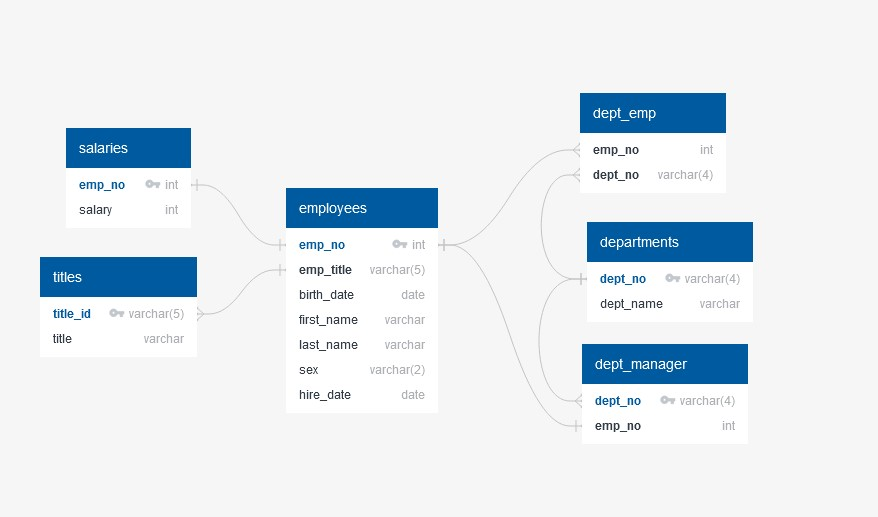

# sql-challenge
An exercise using some basic SQL methods

This repository contains two .sql files:
 - *schema_mj.sql* is used to create tables from the CSV files in the _data_ folder - including all relationships.
 - *analysis_mj.sql* contains the queries requested in the challenge rubric.

The repository also contains a .jpg, *relationship_diagram.jpg*, which shows the relationships between all tables. This diagram was created using [QuickDBD](https://app.quickdatabasediagrams.com/#/)

The schema file contains some code exported from QuickDBD, but I did have to create the schema in order to get the information into QuickDBD (the website uses different syntax than PostgreSQL and I exported it in PostgreSQL).
All other code was written by me - Google helped with syntax on occasion.
